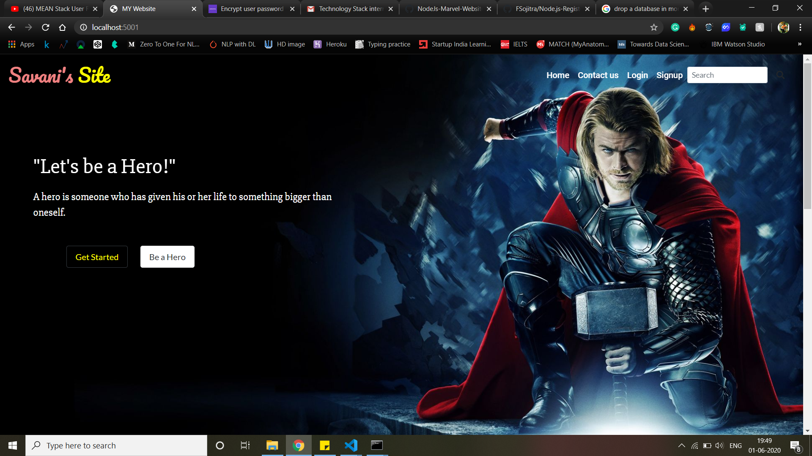
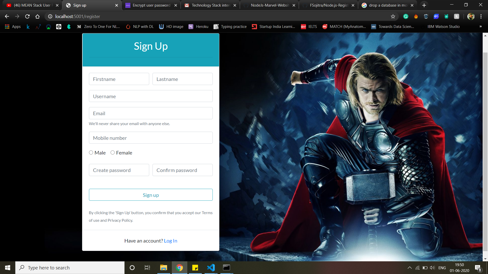
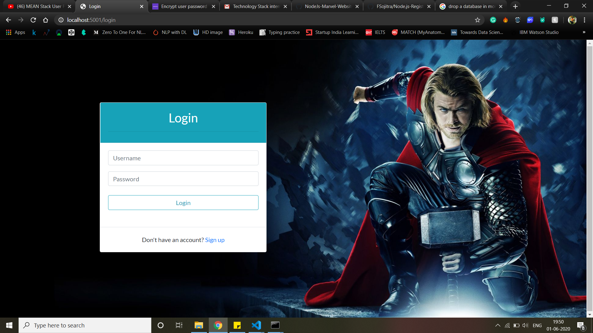
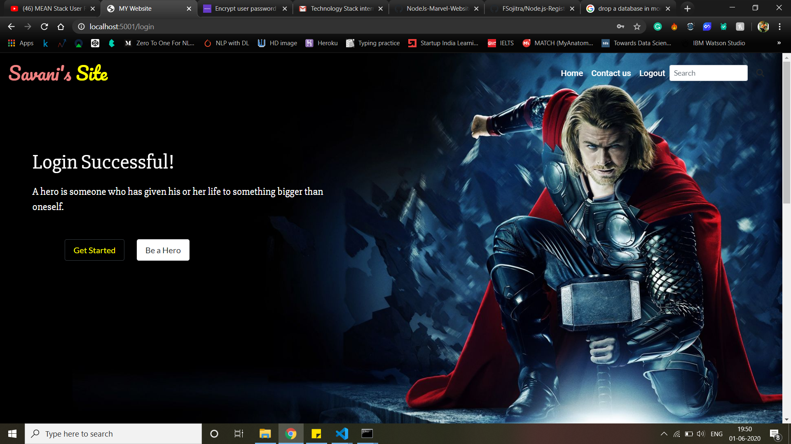

# NodeJs-Marvel-Website
#### This is a user login and registration app using Node.js, Express, Mongoose and express-sessions.
### Getting Started   
These instructions will get you a copy of the project up and running on your local machine for development and testing purposes. 

### Prerequisites
You need to have installed Node.js, NPM and MongoDB in your System.

### Installing
1. npm install

### To Run
1. open cmd and rub mongod
2. node app

### Incase app.js will give you error try running server.js

### Code is Running on
Link - http://localhost:5001/   

### Screenshots
##### 1. Home page

##### 2. Register Page

##### 3. Login Page

##### 4. Logged in Page

Thanks 😃
